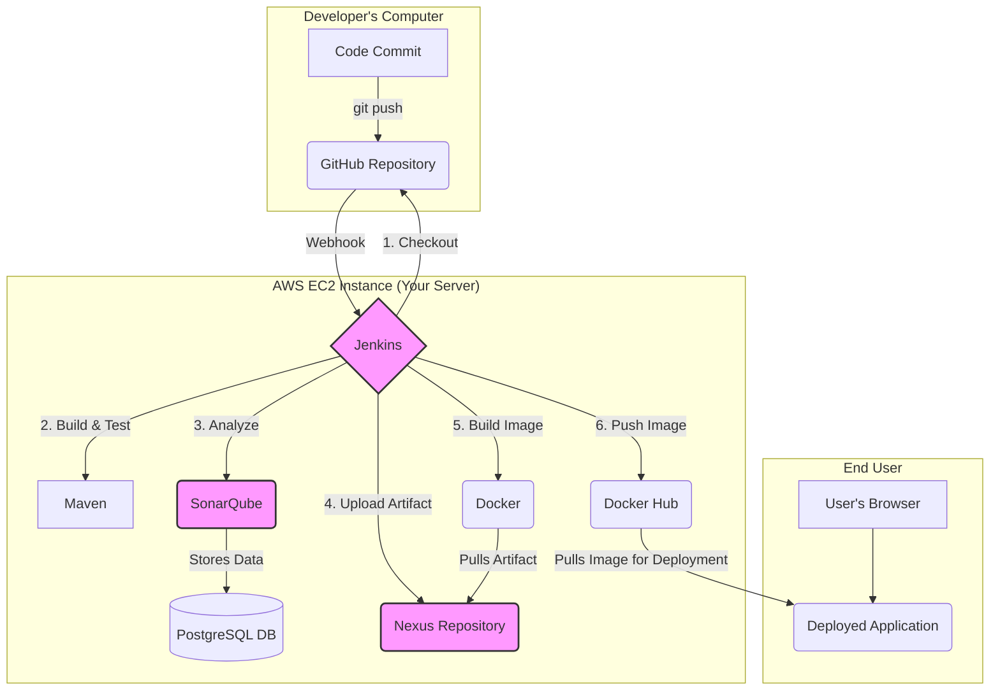

# EC2 Deployment Guide: CI/CD Pipeline (Simplified)

---

## 📑 Table of Contents

1. [What Is This Project?](#-what-is-this-project)
2. [Prerequisites](#-prerequisites-what-you-need-before-starting)
3. [EC2 Instance Requirements](#️-ec2-instance-requirements-your-cloud-server)
4. [Step-by-Step Checklist](#-your-step-by-step-checklist)
5. [Phase 1: EC2 Instance Setup](#-phase-1-ec2-instance-setup-creating-your-cloud-server) (⏱️ 30-40 min)
6. [Phase 2: Launch Services](#️-phase-2-define-and-run-services-with-docker-compose) (⏱️ 15-20 min)
7. [Phase 3: Configure Services](#️-phase-3-configure-services) (⏱️ 30-40 min)
8. [Phase 4: Application Configuration](#️-phase-4-application-configuration) (⏱️ 15-20 min)
9. [Phase 5: Jenkins Configuration](#-phase-5-jenkins-configuration) (⏱️ 20-30 min)
10. [Phase 6: Test The Pipeline](#-phase-6-test-the-pipeline) (⏱️ 10-15 min)

---

## 🎯 What Is This Project?

Think of this as building a **"software factory"** on a cloud server:
1. **Jenkins** = The factory manager (automates everything)
2. **SonarQube** = Quality inspector (checks code quality)
3. **Nexus** = Warehouse (stores your built software)
4. **Docker** = Shipping containers (packages your app to run anywhere)

<details>
<summary>▶ Click to see the CI/CD Architecture Diagram</summary>

> **Note:** If you're viewing this on GitHub, the diagram below will render properly. If viewing in a text editor, see the ASCII version below.



**ASCII Diagram (if Mermaid doesn't render):**

```
┌─────────────────────────────────────────────────────────────────────┐
│  Developer's Computer                                               │
│  ┌─────────────┐        git push         ┌──────────────┐          │
│  │ Code Commit │ ──────────────────────> │   GitHub     │          │
│  └─────────────┘                         │  Repository  │          │
└──────────────────────────────────────────┴──────┬───────┴──────────┘
                                                   │ Webhook
┌──────────────────────────────────────────────────┼─────────────────┐
│  AWS EC2 Instance (Your Server)                  ▼                 │
│                                         ┌──────────────────┐       │
│                     ┌───────────────────│     Jenkins      │       │
│                     │                   │  (Orchestrator)  │       │
│                     │                   └────┬──┬──┬──┬────┘       │
│                     │                        │  │  │  │            │
│    1. Checkout ─────┘                        │  │  │  │            │
│                                               │  │  │  │            │
│    2. Build & Test ──────────> ┌──────────┐  │  │  │  │            │
│                                 │  Maven   │──┘  │  │  │            │
│                                 └──────────┘     │  │  │            │
│                                                  │  │  │            │
│    3. Analyze ────────────────> ┌────────────┐  │  │  │            │
│                                  │ SonarQube  │◄─┘  │  │            │
│                                  │   +        │     │  │            │
│                                  │ PostgreSQL │     │  │            │
│                                  └────────────┘     │  │            │
│                                                     │  │            │
│    4. Upload Artifact ──────────> ┌─────────────┐  │  │            │
│                                    │   Nexus     │◄─┘  │            │
│                                    │ Repository  │     │            │
│                                    └──────┬──────┘     │            │
│                                           │            │            │
│    5. Build Docker Image ────────> ┌─────┴──────┐     │            │
│                                     │   Docker   │◄────┘            │
│                                     └─────┬──────┘                  │
│                                           │                         │
│    6. Push Image ──────────────> ┌────────┴────────┐               │
│                                   │   Docker Hub    │               │
│                                   └────────┬────────┘               │
└───────────────────────────────────────────┼────────────────────────┘
                                            │ Pull Image
                                            ▼
                                   ┌─────────────────┐
                                   │  Deployed App   │
                                   │  (End User)     │
                                   └─────────────────┘
```

**Pipeline Flow Summary:**
1. Developer commits code → GitHub
2. GitHub webhook triggers Jenkins
3. Jenkins checks out code
4. Maven builds & tests the application
5. SonarQube analyzes code quality
6. Artifact uploaded to Nexus
7. Docker builds container image (pulls artifact from Nexus)
8. Image pushed to Docker Hub
9. Application deployed from Docker Hub image

</details>

---

## ✅ Prerequisites (What You Need Before Starting)

### 1. AWS Account
- You'll need an AWS account. You can sign up at https://aws.amazon.com.
- **Cost estimate**: ~$60-80/month for this setup.

> ### ⚠️ IMPORTANT: AWS Cost Warning
> 
> The EC2 instance type we use (`t3.large`) is **NOT part of the AWS Free Tier**.  
> **You WILL be charged** for every hour it runs (~$0.0832/hour or ~$60/month).
> 
> **To minimize costs:**
> - ✅ **STOP** your EC2 instance from AWS Console when not in use (saves ~80% of costs)
> - ✅ **TERMINATE** the instance when you're completely done
> - ⚠️ **WARNING:** Stopping/restarting changes your Public IP - you'll need to update it everywhere
> 
> 💡 **Pro tip:** Set up a billing alarm in AWS to get notified if costs exceed $10/month

### 2. Basic Knowledge
- How to copy and paste commands.
- A willingness to learn!

### 3. Tools & Accounts
<details>
<summary>▶ Click to see required tools and accounts</summary>

- **SSH Client**:
    - **Windows**: Git Bash (recommended) or PuTTY.
    - **Mac/Linux**: Terminal (already installed).
- **Text Editor**: Notepad++, VS Code, or any other text editor.
- **Docker Hub account** (free): https://hub.docker.com
- **GitHub account** (free): https://github.com
</details>

---

## 🖥️ EC2 Instance Requirements (Your Cloud Server)

We need a medium-sized virtual server on AWS.
- **Instance Type**: `t3.large` (2 CPUs, 8GB RAM)
- **Storage**: 50GB SSD
- **Operating System**: Ubuntu 20.04 LTS

<details>
<summary>▶ Click for Detailed Specs and Security Group Rules</summary>

### Detailed Specs:
- **Instance Type**: t3.large or t3.xlarge
- **CPU**: 2+ vCPUs
- **RAM**: 8GB+
- **Storage**: 50GB+ SSD (gp3)
- **OS**: Ubuntu 20.04 LTS
- **Security Group**: Open ports 22, 8080, 8081, 8090, 9000

### Security Group Configuration (Firewall Rules)
These rules control who can access your server.

| Port | Service | Access | Explanation |
|------|---------------|----------------|-------------|
| 22 | SSH (Terminal) | **Your IP Only** ⚠️ | Your remote control to the server. KEEP PRIVATE! |
| 8080 | Java App | Anywhere (0.0.0.0/0) | Where users access your website |
| 8081 | Nexus | Anywhere (0.0.0.0/0) | Repository management UI |
| 8090 | Jenkins | Anywhere (0.0.0.0/0) | CI/CD dashboard |
| 9000 | SonarQube | Anywhere (0.0.0.0/0) | Code analysis reports |

**Note:** For learning, we allow public access to the web UIs. In a real production environment, you would restrict these IPs.
</details>

---

## ✅ Your Step-by-Step Checklist

Follow these phases in order to track your progress:

- [ ] **Phase 1: EC2 Server Setup** ⏱️ 30-40 min - Create your cloud server and install basic tools
- [ ] **Phase 2: Launch Services** ⏱️ 15-20 min - Define and run Jenkins, SonarQube, and Nexus with Docker Compose
- [ ] **Phase 3: Configure Services** ⏱️ 30-40 min - Perform the initial setup for each tool
- [ ] **Phase 4: Configure Application** ⏱️ 15-20 min - Prepare your Java application for the pipeline
- [ ] **Phase 5: Configure Jenkins Pipeline** ⏱️ 20-30 min - Create the automation job in Jenkins
- [ ] **Phase 6: Test The Pipeline** ⏱️ 10-15 min - Run the full CI/CD pipeline and deploy

**Total estimated time:** 2-3 hours (first time) | 30-45 minutes (experienced)

---

## 🚀 Phase 1: EC2 Instance Setup (Creating Your Cloud Server)

**⏱️ Time:** 30-40 minutes  
**Goal:** Create a virtual server in the cloud and install the necessary tools.

### 1.1 Launch EC2 Instance
This involves creating the virtual computer on AWS.

<details>
<summary>▶ Step-by-step guide to launch the EC2 instance</summary>

1.  **Log into AWS Console** and navigate to the **EC2** service.
2.  Click **"Launch Instance"**.
3.  **Name**: `my-cicd-server`.
4.  **Application and OS Images (AMI)**: Select **Ubuntu**, version **Ubuntu Server 20.04 LTS**.
5.  **Instance type**: Select **t3.large**.
6.  **Key pair (login)**:
    - Click **"Create new key pair"**.
    - Name it `my-cicd-key`.
    - Choose **RSA** and **`.pem`** format.
    - Click **"Create key pair"** and **save the downloaded file securely**. You cannot download it again.
7.  **Network settings**:
    - Click **"Edit"**.
    - Name the security group `cicd-security-group`.
    - Add the required inbound security group rules as listed in the table above (ports 22, 8080, 8081, 8090, 9000). For port 22 (SSH), set the source to **My IP**.
8.  **Configure storage**: Change the size to **50 GB** and select **gp3**.
9.  **Launch instance**.
10. After launching, go to "View all instances", select your instance, and copy the **"Public IPv4 address"**. Save this IP address.
</details>

### 1.2 Connect to Your EC2 Instance
Use SSH to get a command-line interface to your new server.

<details>
<summary>▶ How to connect via SSH (Mac, Linux, & Windows)</summary>

#### For Mac/Linux Users:
1.  Open a terminal and navigate to where you saved your `.pem` key file.
    ```bash
    cd ~/Downloads
    ```
2.  Set the correct permissions for the key file.
    ```bash
    chmod 400 my-cicd-key.pem
    ```
3.  Connect to the instance using its public IP.
    ```bash
    ssh -i my-cicd-key.pem ubuntu@YOUR-EC2-IP
    ```
    (Replace `YOUR-EC2-IP` with the address you copied).
4.  Type `yes` if prompted to continue connecting.

#### For Windows Users (Git Bash):
1.  Install Git Bash from https://git-scm.com/download/win.
2.  Follow the same steps as Mac/Linux users inside the Git Bash terminal.
</details>

### 1.3 System Updates and Basic Setup
Install essential software on your new server.

1.  **Update Ubuntu**:
    ```bash
    sudo apt update && sudo apt upgrade -y
    ```
2.  **Install Basic Tools**:
    ```bash
    sudo apt install -y git wget curl unzip htop
    ```
3.  **Install Docker**:
    ```bash
    curl -fsSL https://get.docker.com -o get-docker.sh
    sudo sh get-docker.sh
    ```
4.  **Add your user to the `docker` group**:
    ```bash
    sudo usermod -aG docker $USER
    newgrp docker
    ```
5.  **Install Docker Compose**:
    ```bash
    sudo curl -L "https://github.com/docker/compose/releases/latest/download/docker-compose-$(uname -s)-$(uname -m)" -o /usr/local/bin/docker-compose
    sudo chmod +x /usr/local/bin/docker-compose
    ```
6.  **Verify installation**:
    ```bash
    docker --version
    docker-compose --version
    docker run hello-world
    ```
    You should see the "Hello from Docker!" message.

### 1.4 Setup Project Directory
Create a folder for your project files on the EC2 server.

```bash
mkdir -p ~/projects/sample-java-app
cd ~/projects/sample-java-app
pwd
```

### ✅ Phase 1 Complete - Verify Success

Before moving to Phase 2, verify everything is working:

```bash
# Check Docker is installed and running
docker --version
docker-compose --version

# Check you're in the right directory
pwd
# Expected output: /home/ubuntu/projects/sample-java-app
```

**Expected results:**
- ✅ Docker version shown (e.g., "Docker version 20.x.x")
- ✅ Docker Compose version shown (e.g., "docker-compose version 1.29.x")
- ✅ You're in the `/home/ubuntu/projects/sample-java-app` directory

**If something failed:** See [Troubleshooting Guide](#-troubleshooting-guide)

---

## 🏗️ Phase 2: Define and Run Services with Docker Compose

**⏱️ Time:** 15-20 minutes  
**Goal:** Define all our services (Jenkins, SonarQube, etc.) in a single file and launch them.

### 2.1 Create a Custom Jenkins Dockerfile
We need a custom Jenkins image with Docker and Maven installed.

1.  **Create a `jenkins` directory**:
    ```bash
    # Make sure you are in ~/projects/sample-java-app
    mkdir jenkins
    ```
2.  **Create a file named `jenkins/Dockerfile`** with the following content.

<details>
<summary>▶ Click to see the Jenkins Dockerfile content</summary>

```dockerfile
# Start from the official Jenkins LTS image
FROM jenkins/jenkins:lts

# Switch to the root user to install software
USER root

# Install Docker CLI so Jenkins can interact with Docker
RUN apt-get update && \
    apt-get install -y --no-install-recommends docker.io && \
    apt-get clean && \
    rm -rf /var/lib/apt/lists/*

# Install Maven to build the Java project
RUN apt-get update && \
    apt-get install -y --no-install-recommends maven && \
    apt-get clean && \
    rm -rf /var/lib/apt/lists/*

# Add the 'jenkins' user to the 'docker' group to grant permissions
RUN usermod -aG docker jenkins

# Pre-install the Jenkins plugins we need for the pipeline
RUN jenkins-plugin-cli --plugins \
    git \
    workflow-aggregator \
    docker-workflow \
    sonar \
    nexus-artifact-uploader \
    credentials-binding \
    config-file-provider

# Switch back to the standard 'jenkins' user
USER jenkins
```
</details>

### 2.2 Create the `docker-compose.yml` File
This file is the master recipe for all our services. Create a file named `docker-compose.yml` in the `~/projects/sample-java-app` directory.

<details>
<summary>▶ Click to see the docker-compose.yml content</summary>

```yaml
version: '3.8'

# This section defines all the services (containers) we want to run.
services:
  # Service 1: PostgreSQL Database for SonarQube
  postgres:
    image: postgres:13
    container_name: postgres-sonar
    networks:
      - cicd-network
    environment:
      - POSTGRES_USER=sonar
      - POSTGRES_PASSWORD=sonar
      - POSTGRES_DB=sonarqube
    volumes:
      - postgres-data:/var/lib/postgresql/data
    restart: unless-stopped

  # Service 2: SonarQube for Code Quality Analysis
  sonarqube:
    image: sonarqube:9.9-community
    container_name: sonarqube
    ports:
      - "9000:9000"
    networks:
      - cicd-network
    environment:
      - SONAR_JDBC_URL=jdbc:postgresql://postgres:5432/sonarqube
      - SONAR_JDBC_USERNAME=sonar
      - SONAR_JDBC_PASSWORD=sonar
    volumes:
      - sonarqube-data:/opt/sonarqube/data
      - sonarqube-logs:/opt/sonarqube/logs
      - sonarqube-extensions:/opt/sonarqube/extensions
    restart: unless-stopped
    depends_on:
      - postgres # Tells Docker to wait for postgres to be ready

  # Service 3: Nexus for Artifact Storage
  nexus:
    image: sonatype/nexus3:latest
    container_name: nexus
    ports:
      - "8081:8081"
    networks:
      - cicd-network
    volumes:
      - nexus-data:/nexus-data
    restart: unless-stopped

  # Service 4: Jenkins for CI/CD Automation
  jenkins:
    build:
      context: ./jenkins # Use the custom Dockerfile in the 'jenkins' directory
    container_name: jenkins
    ports:
      - "8090:8080"
      - "50000:50000"
    networks:
      - cicd-network
    volumes:
      - jenkins-home:/var/jenkins_home
      - /var/run/docker.sock:/var/run/docker.sock # Allow Jenkins to use Docker
    restart: unless-stopped

# This section defines the network that allows containers to communicate.
networks:
  cicd-network:
    driver: bridge

# This section defines the volumes that persist our data.
volumes:
  postgres-data:
  sonarqube-data:
  sonarqube-logs:
  sonarqube-extensions:
  nexus-data:
  jenkins-home:
```
</details>

### 2.3 Start All Services
Now, you can start, stop, and manage all services with simple commands.

1.  **Start the entire stack in the background**:
    ```bash
    docker-compose up --build -d
    ```
    The first run will take 3-5 minutes to download and build everything.

2.  **Check the status of your services**:
    ```bash
    docker-compose ps
    ```
    Wait until all services show a status of `Up` or `running`. SonarQube and Nexus can be slow to start.

3.  **To view logs for a specific service**:
    ```bash
    docker-compose logs -f <service_name>
    # Example: docker-compose logs -f jenkins
    ```

4.  **To stop all services**:
    ```bash
    docker-compose down
    ```


5. install docker inside jenkins container

```bash
docker exec -it -u root jenkins bash
```
   install docker Inside jenkins container:
```bash
curl -fsSL https://get.docker.com -o get-docker.sh
sh get-docker.sh
chmod 666 /var/run/docker.sock
exit
```

### ✅ Phase 2 Complete - Verify Success

Check that all services are running properly:

```bash
# Check all containers are running
docker-compose ps

# Check specific service logs (if needed)
docker-compose logs jenkins
docker-compose logs sonarqube
```

**Expected results:**
- ✅ All 4 services show status `Up` or `running` (jenkins, sonarqube, nexus, postgres)
- ✅ No continuous error messages in logs
- ⏳ SonarQube and Nexus may take 2-3 minutes to fully start

**Common issues:**
- Container keeps restarting? Check logs: `docker-compose logs <service-name>`
- Out of memory? Your EC2 instance may be too small (need t3.large minimum)

**If something failed:** See [Troubleshooting Guide](#-troubleshooting-guide)

---

## ⚙️ Phase 3: Configure Services

**⏱️ Time:** 30-40 minutes  
**Goal:** Perform the initial setup for Jenkins, SonarQube, and Nexus.

### 3.1 Jenkins Setup
1.  **Access Jenkins**: `http://YOUR-EC2-IP:8090`
2.  **Get Initial Password**: Run this on your EC2 server to get the password.
    ```bash
    docker exec jenkins cat /var/jenkins_home/secrets/initialAdminPassword
    ```
3.  **Complete Setup Wizard**: Paste the password, install suggested plugins, and create your admin user.

### 3.2 SonarQube Setup
1. **Access SonarQube**: `http://YOUR-EC2-IP:9000` (May take a few minutes to start).

2. **Login**: Default credentials are `admin` / `admin`. You will be forced to change the password.

3.  **Generate an Authentication Token**: This token will be used by Jenkins to connect to SonarQube.
    <details>
    <summary>▶ Step-by-step: How to generate a SonarQube token</summary>

    1.  Click your profile icon (top right) → **My Account** → **Security**.
    2.  Under "Generate Tokens", give the token a name (e.g., `jenkins-sonar-token`).
    3.  Click **Generate** and **copy the token immediately**. You will not be able to see it again. Save it for the Jenkins configuration phase.
    </details>
    
4.  **Create a Project**: This defines the quality standards for your code.
    
    <details>
    <summary>▶ Step-by-step: How to create a project and quality gate</summary>
    
    1.  **Create Project**: In SonarQube, click **Create Project** → **Manually**.
        - Project display name: `Sample Java Web Application`
        - Project key: `sample-webapp`
          </details>
    
5.  **Configure a Webhook**: This allows SonarQube to send the analysis result back to Jenkins.
    <details>
    <summary>▶ Step-by-step: How to configure the SonarQube webhook</summary>

    1.  Go to **Administration** → **Configuration** → **Webhooks**.
    2.  Click **Create**.
    3.  **Name**: `Jenkins`
    4.  **URL**: `http://jenkins:8090/sonarqube-webhook/` (This uses the Docker service name).
    5.  Click **Create**.
    </details>

### 3.3 Nexus Setup
1.  **Access Nexus**: `http://YOUR-EC2-IP:8081` (May take a few minutes to start).
2.  **Get Initial Password**: Run this on your EC2 server.
    ```bash
    docker exec nexus cat /nexus-data/admin.password
    ```
3.  **Login**: Use username `admin` and the password you just retrieved. Complete the setup wizard and change your password.
4.  **Create Maven Repositories**: We need three repositories to store our Java artifacts.
    <details>
    <summary>▶ Step-by-step: How to create Nexus repositories</summary>

    1.  Click the **⚙️ Settings** icon → **Repositories** → **Create repository**.
    2.  Create a **`maven2 (hosted)`** repository named `maven-snapshots`.
        - **Version policy**: `Snapshot`
        - **Deployment policy**: `Allow redeploy`
    3.  Create another **`maven2 (hosted)`** repository named `maven-releases`.
        - **Version policy**: `Release`
        - **Deployment policy**: `Disable redeploy`
    4.  Create a **`maven2 (group)`** repository named `maven-public`.
        - Add `maven-releases`, `maven-snapshots`, and the default `maven-central` to the **Members** list.
        </details>
5.  **Create a Deployment User**: Jenkins will use this user to upload artifacts.
    <details>
    <summary>▶ Step-by-step: How to create a Nexus deployment user</summary>

    1.  Go to **⚙️ Settings** → **Security** → **Users** → **Create local user**.
    2.  **ID**: `jenkins-deployer`
    3.  **Password**: Create a password and save it.
    4.  **Grant Role**: Assign the `nx-admin` role to this user. (Or a more restrictive deployment role).
    5.  Save the username and password for the Jenkins configuration phase.
    </details>

### ✅ Phase 3 Complete - Verify Success

Confirm all services are configured and accessible:

**Check Jenkins:**
- ✅ Can access `http://YOUR-EC2-IP:8090`
- ✅ Successfully logged in with admin user
- ✅ Plugins installed

**Check SonarQube:**
- ✅ Can access `http://YOUR-EC2-IP:9000`
- ✅ Created authentication token (saved securely)
- ✅ Created project `sample-webapp`
- ✅ Created and assigned quality gate
- ✅ Webhook configured

**Check Nexus:**
- ✅ Can access `http://YOUR-EC2-IP:8081`
- ✅ Successfully logged in
- ✅ Created 3 repositories: `maven-snapshots`, `maven-releases`, `maven-public`
- ✅ Created `jenkins-deployer` user with credentials saved

**If something failed:** See [Troubleshooting Guide](#-troubleshooting-guide)

---

## 🛠️ Phase 4: Application Configuration

**⏱️ Time:** 15-20 minutes  
**Goal:** Create the configuration files that define how the application is built, tested, and deployed. All files should be created inside your `~/projects/sample-java-app` directory on the EC2 server.

### 4.1 Create Application Dockerfiles
We need one Dockerfile for development and another for production builds.

<details>
<summary>▶ Click to see Dockerfile.dev content</summary>

Create a file named `Dockerfile.dev`:

> **📝 Note:**  
> This is a **development Dockerfile** that builds the application from source code. It uses a multi-stage build where:
> - **Stage 1 (builder)**: Compiles the Java code using Maven, downloading dependencies from Maven Central (public repository)
> - **Stage 2 (runtime)**: Copies the compiled WAR file into a Tomcat server
> 
> **No Nexus credentials needed** - Maven dependencies come from the public Maven Central repository, not your private Nexus.

```dockerfile
# Multi-stage build - compiles from source
FROM maven:3.8-openjdk-21 AS builder
WORKDIR /app
COPY pom.xml .
RUN mvn dependency:go-offline
COPY src ./src
RUN mvn clean package -DskipTests

# Runtime stage
FROM tomcat:9-jre21
LABEL maintainer="admin@example.com"
LABEL application="sample-webapp"
LABEL version="dev"

# Remove default webapps
RUN rm -rf /usr/local/tomcat/webapps/*

# Copy WAR file from builder stage
COPY --from=builder /app/target/sample-webapp.war /usr/local/tomcat/webapps/ROOT.war

# Expose port
EXPOSE 8080
CMD ["catalina.sh", "run"]
```
</details>

<details>
<summary>▶ Click to see Dockerfile content (for production)</summary>

Create a file named `Dockerfile`:

> **📝 Important Note About Nexus Download:**  
> This is the **production Dockerfile** used by Jenkins to create the final Docker image. It works as follows:
> 
> **How it works:**
> 1. Jenkins first uploads the WAR file to Nexus (using the `jenkins-deployer` credentials in Phase 5.2)
> 2. Then this Dockerfile downloads that WAR file from Nexus
> 3. The downloaded WAR is packaged into the Docker image
> 
> **⚠️ Authentication Required:**
> - If you've disabled anonymous access in Nexus (recommended for security), this Dockerfile needs credentials to download
> - Nexus credentials are passed as build arguments (`NEXUS_USERNAME` and `NEXUS_PASSWORD`)
> - These will be injected by Jenkins during the Docker build stage using the same `nexus-credentials` from Phase 5.2
> - The `wget --user` and `--password` flags authenticate the download request
> 
> **ARG values explained:**
> - `NEXUS_URL`: Points to your Nexus service (http://nexus:8081)
> - `NEXUS_REPO`: The repository name you created in Phase 3.3 (`maven-snapshots`)
> - `NEXUS_USERNAME` & `NEXUS_PASSWORD`: Your `jenkins-deployer` credentials (passed by Jenkins at build time)
> - `GROUP_ID`, `ARTIFACT_ID`, `VERSION`: Match your `pom.xml` configuration

```dockerfile
FROM tomcat:9-jre21
LABEL maintainer="admin@example.com"
LABEL application="sample-webapp"

# Remove default webapps
RUN rm -rf /usr/local/tomcat/webapps/*

# Copy WAR file from build context
COPY sample-webapp.war /usr/local/tomcat/webapps/ROOT.war

# Expose port
EXPOSE 8080
CMD ["catalina.sh", "run"]
```
</details>

### 4.2 Create Jenkinsfile and `pom.xml`
The `Jenkinsfile` is the heart of our pipeline, defining every stage. The `pom.xml` is Maven's configuration file for building the Java project.

<details>
<summary>▶ Click to see Jenkinsfile content</summary>

Create a file named `Jenkinsfile`. 

> **📝 Important Notes:**
> - **Change `yourusername`** to your Docker Hub username in the `DOCKER_IMAGE` variable
> - **Nexus credentials** are used in two stages:
>   - `Deploy to Nexus`: Uploads the WAR file to Nexus repository
>   - `Build Docker Image`: Passes credentials to Docker so it can download the WAR from Nexus (required when anonymous access is disabled)

```groovy
pipeline {
    agent any
    
    environment {
        SONARQUBE_URL          = 'http://sonarqube:9000'
        NEXUS_URL              = 'http://nexus:8081'
        DOCKER_IMAGE           = "ashuz/sample-webapp" // CHANGE THIS
        VERSION                = "${env.BUILD_NUMBER}"
    }
    
    tools {
        maven 'Maven-3.8'
        jdk 'JDK-21'
    }
    
    stages {
        stage('Checkout') {
            steps {
                echo "Checking out code..."
                checkout scm
            }
        }
        
        stage('Build & Unit Tests') {
            steps {
                echo "Building and running unit tests..."
                sh 'mvn clean package'
            }
            post {
                always {
                    junit '**/target/surefire-reports/*.xml'
                }
            }
        }
        
        stage('SonarQube Analysis') {
            steps {
                echo "Running SonarQube analysis. NOTE: The explicit Quality Gate check is temporarily disabled for debugging."
                withCredentials([string(credentialsId: 'sonarqube-token', variable: 'SONAR_TOKEN')]) {
                    sh "mvn sonar:sonar -Dsonar.host.url=${env.SONARQUBE_URL} -Dsonar.login=${SONAR_TOKEN}"
                }
            }
        }
        
        stage('Deploy to Nexus') {
            steps {
                withCredentials([usernamePassword(credentialsId: 'nexus-credentials', passwordVariable: 'NEXUS_PASSWORD', usernameVariable: 'NEXUS_USERNAME')]) {
                    sh """
                        mvn deploy -DskipTests \
                        -s settings.xml
                    """
                }
            }
        }
        
        stage('Build Docker Image') {
            steps {
                withCredentials([usernamePassword(credentialsId: 'nexus-credentials', passwordVariable: 'NEXUS_PASSWORD', usernameVariable: 'NEXUS_USERNAME')]) {
                    script {
                        def pomContent = readFile 'pom.xml'
                        def pomVersion = (pomContent =~ '<version>(.+)</version>')[0][1]
                        
                        // Get the latest snapshot version from maven-metadata.xml
                        sh """
                            curl -u ${NEXUS_USERNAME}:${NEXUS_PASSWORD} \
                            -s -o maven-metadata.xml \
                            "${NEXUS_URL}/repository/maven-snapshots/com/example/sample-webapp/${pomVersion}/maven-metadata.xml"
                        """
                        
                        def metadata = readFile('maven-metadata.xml')
                        def timestamp = (metadata =~ /<timestamp>(.+)<\/timestamp>/)[0][1]
                        def buildNumber = (metadata =~ /<buildNumber>(.+)<\/buildNumber>/)[0][1]
                        def snapshotVersion = pomVersion.replace('-SNAPSHOT', "-${timestamp}-${buildNumber}")
                        
                        echo "Downloading snapshot version: ${snapshotVersion}"
                        
                        // Download WAR from Nexus using snapshot version
                        sh """
                            curl -u ${NEXUS_USERNAME}:${NEXUS_PASSWORD} \
                            -L -o sample-webapp.war \
                            "${NEXUS_URL}/repository/maven-snapshots/com/example/sample-webapp/${pomVersion}/sample-webapp-${snapshotVersion}.war"
                        """
                        
                        // Build Docker image
                        docker.build("${DOCKER_IMAGE}:${VERSION}")
                    }
                }
            }
        }
        
        stage('Push to Docker Hub') {
            steps {
                withCredentials([usernamePassword(credentialsId: 'dockerhub-credentials', passwordVariable: 'DOCKER_PASSWORD', usernameVariable: 'DOCKER_USERNAME')]) {
                    sh "docker login -u ${DOCKER_USERNAME} -p ${DOCKER_PASSWORD}"
                    sh "docker push ${DOCKER_IMAGE}:${VERSION}"
                    sh "docker tag ${DOCKER_IMAGE}:${VERSION} ${DOCKER_IMAGE}:latest"
                    sh "docker push ${DOCKER_IMAGE}:latest"
                }
            }
        }
    }
    
    post {
        always {
            echo "Cleaning up workspace..."
            cleanWs()
        }
    }
}

```
</details>

<details>
<summary>▶ Click to see pom.xml content</summary>

Create a file named `pom.xml`. This file defines the project's dependencies and build settings.
```xml
<?xml version="1.0" encoding="UTF-8"?>
<project xmlns="http://maven.apache.org/POM/4.0.0"
         xmlns:xsi="http://www.w3.org/2001/XMLSchema-instance"
         xsi:schemaLocation="http://maven.apache.org/POM/4.0.0 
         http://maven.apache.org/xsd/maven-4.0.0.xsd">
    
    <modelVersion>4.0.0</modelVersion>
    
    <groupId>com.example</groupId>
    <artifactId>sample-webapp</artifactId>
    <version>1.0-SNAPSHOT</version>
    <packaging>war</packaging>
    
    <name>Sample Java Web Application</name>
    
    <properties>
        <maven.compiler.source>21</maven.compiler.source>
        <maven.compiler.target>21</maven.compiler.target>
        <project.build.sourceEncoding>UTF-8</project.build.sourceEncoding>
        <sonar.projectKey>sample-webapp</sonar.projectKey>
    </properties>
    
    <dependencies>
        <dependency>
            <groupId>javax.servlet</groupId>
            <artifactId>javax.servlet-api</artifactId>
            <version>4.0.1</version>
            <scope>provided</scope>
        </dependency>
        <dependency>
            <groupId>junit</groupId>
            <artifactId>junit</artifactId>
            <version>4.13.2</version>
            <scope>test</scope>
        </dependency>
    </dependencies>
    
    <build>
        <finalName>sample-webapp</finalName>
        <plugins>
            <plugin>
                <groupId>org.apache.maven.plugins</groupId>
                <artifactId>maven-compiler-plugin</artifactId>
                <version>3.8.1</version>
            </plugin>
            <plugin>
                <groupId>org.apache.maven.plugins</groupId>
                <artifactId>maven-war-plugin</artifactId>
                <version>3.3.1</version>
            </plugin>
            <plugin>
                <groupId>org.sonarsource.scanner.maven</groupId>
                <artifactId>sonar-maven-plugin</artifactId>
                <version>3.9.1.2184</version>
            </plugin>
        </plugins>
    </build>
    
    <distributionManagement>
        <repository>
            <id>nexus-releases</id>
            <url>http://nexus:8081/repository/maven-releases/</url>
        </repository>
        <snapshotRepository>
            <id>nexus-snapshots</id>
            <url>http://nexus:8081/repository/maven-snapshots/</url>
        </snapshotRepository>
    </distributionManagement>
</project>
```
</details>

<details>
<summary>▶ Click to see settings.xml content</summary>

Create a file named `settings.xml`. This file provides credentials to Maven for deploying to Nexus.

> **📝 Important Note About Credentials:**  
> The `${env.NEXUS_USERNAME}` and `${env.NEXUS_PASSWORD}` are environment variables that will be injected by Jenkins during the pipeline execution. These credentials reference:
> - **Username**: `jenkins-deployer` (created in Phase 3.3)
> - **Password**: The password you set for the `jenkins-deployer` user in Nexus
> - **Jenkins Credential ID**: `nexus-credentials` (you'll add this in Phase 5.2)
> 
> You don't need to replace these variables with actual values in this file - Jenkins will automatically inject them at runtime using the credentials you'll configure in Phase 5.

```xml
<settings>
  <servers>
    <server>
      <id>nexus-snapshots</id>
      <username>${env.NEXUS_USERNAME}</username>
      <password>${env.NEXUS_PASSWORD}</password>
    </server>
    <server>
      <id>nexus-releases</id>
      <username>${env.NEXUS_USERNAME}</username>
      <password>${env.NEXUS_PASSWORD}</password>
    </server>
  </servers>
</settings>
```
</details>

### ✅ Phase 4 Complete - Verify Success

Check that all configuration files are created:

```bash
# Verify all files exist in ~/projects/sample-java-app
cd ~/projects/sample-java-app
ls -la

# You should see:
# - Dockerfile
# - Dockerfile.dev
# - Jenkinsfile
# - pom.xml
# - settings.xml
# - docker-compose.yml
# - jenkins/ (directory)
```

**Expected results:**
- ✅ All 6 files/directories listed above exist
- ✅ Files contain the correct content (no empty files)
- ✅ `Jenkinsfile` has your Docker Hub username updated (not "yourusername")

**If something failed:** See [Troubleshooting Guide](#-troubleshooting-guide)

---

## 🚀 Phase 5: Jenkins Configuration

**⏱️ Time:** 20-30 minutes  
**Goal:** Configure Jenkins to find our tools, store our secrets, and run the pipeline job.

### 5.1 Configure Jenkins Tools
1.  Go to **Manage Jenkins** → **Global Tool Configuration**.
2.  **JDK**: Click **Add JDK**, give it a name (`JDK-21`), and choose to install version 21.
3.  **Maven**: Click **Add Maven**, give it a name (`Maven-3.8`), and choose to install version 3.8.x.
4.  Click **Save**.

### 5.2 Configure Jenkins Credentials
Go to **Manage Jenkins** → **Manage Credentials** → **(global)** → **Add Credentials**. Add the following secrets. The **ID** is very important and must match the `Jenkinsfile`.

| Type | ID | Value | Description |
|---|---|---|---|
| Secret Text | `sonarqube-token` | The token you generated in SonarQube. | SonarQube auth token |
| Username/Password | `nexus-credentials` | The `jenkins-deployer` user and password for Nexus. | Nexus deployment user |
| Username/Password | `dockerhub-credentials` | Your Docker Hub username and password/token. | Docker Hub access |
| Username/Password | `git-credentials` | Your GitHub username and password/token. | GitHub repository access |

### 5.3 Configure SonarQube Server
This step is crucial for connecting Jenkins to your SonarQube instance.

1.  Go to **Manage Jenkins** → **Configure System**.
2.  Scroll down to the **SonarQube servers** section.
3.  Click **Add SonarQube**.
4.  **Name**: `SonarQube` (This name **must** match the one used in the `Jenkinsfile`).
5.  **Server URL**: `http://sonarqube:9000`
6.  **Server authentication token**: Select the `sonarqube-token` credential you created in the previous step.
7.  Click **Save**.

### 5.4 Create Jenkins Pipeline Job
1.  On the Jenkins dashboard, click **New Item**.
2.  Enter a name (e.g., `sample-java-app-pipeline`), select **Pipeline**, and click **OK**.
3.  Under the **Pipeline** section, change the **Definition** to **"Pipeline script from SCM"**.
4.  **SCM**: Select **Git**.
5.  **Repository URL**: Enter the URL of your GitHub repository.
6.  **Credentials**: Select your `git-credentials`.
7.  **Script Path**: Ensure it is `Jenkinsfile`.
8.  Click **Save**.

### 5.5 Configure GitHub Webhook (for Automatic Builds)
This makes Jenkins build automatically every time you `git push`.

<details>
<summary>▶ Step-by-step: How to configure a GitHub webhook</summary>

1.  **In your Jenkins job configuration**, go to the **Build Triggers** section and check **"GitHub hook trigger for GITScm polling"**.
2.  **In your GitHub repository**, go to **Settings** → **Webhooks** → **Add webhook**.
3.  **Payload URL**: `http://YOUR-EC2-IP:8090/github-webhook/`
4.  **Content type**: `application/json`
5.  **Which events?**: Select **"Just the push event"**.
6.  Click **Add webhook**. You should see a green checkmark indicating it connected successfully.
</details>

### ✅ Phase 5 Complete - Verify Success

Confirm Jenkins is fully configured:

**Check Tools:**
- ✅ JDK-21 configured in Global Tool Configuration
- ✅ Maven-3.8 configured in Global Tool Configuration

**Check Credentials:**
- ✅ `sonarqube-token` (Secret Text) added
- ✅ `nexus-credentials` (Username/Password) added
- ✅ `dockerhub-credentials` (Username/Password) added
- ✅ `git-credentials` (Username/Password) added

**Check SonarQube Configuration:**
- ✅ SonarQube server named `SonarQube` configured in **Configure System**
- ✅ Server URL set to `http://sonarqube:9000`

**Check Pipeline Job:**
- ✅ Pipeline job created (e.g., `sample-java-app-pipeline`)
- ✅ SCM set to Git with your repository URL
- ✅ Credentials selected for Git
- ✅ Script Path set to `Jenkinsfile`
- ✅ GitHub webhook configured (optional but recommended)

**If something failed:** See [Troubleshooting Guide](#-troubleshooting-guide)

---

## ✅ Phase 6: Test The Pipeline

**⏱️ Time:** 10-15 minutes  
**Goal:** Run the complete CI/CD pipeline end-to-end.

You are all set!
1.  Make a change to the code in your local repository.
2.  Commit and push the change to GitHub.
    ```bash
    git add .
    git commit -m "Test commit for CI/CD pipeline"
    git push
    ```
3.  Go to your Jenkins dashboard. You should see a build start automatically in the "Build History".
4.  Click on the build number and then "Console Output" to watch the pipeline run through all the stages.

If everything is configured correctly, the pipeline will complete successfully, and you will have:
- A new artifact in your Nexus repository.
- A new Docker image in your Docker Hub repository.
- A green, successful build in Jenkins!

### ✅ Phase 6 Complete - Verify Success

Verify the pipeline executed successfully:

**Check Jenkins:**
- ✅ Build shows green/success status
- ✅ All stages completed (Checkout, Build & Unit Tests, SonarQube Analysis, Quality Gate, Deploy to Nexus, Build Docker Image, Push to Docker Hub)
- ✅ No red/failed stages

**Check Nexus:**
- ✅ Visit `http://YOUR-EC2-IP:8081` → Browse → maven-snapshots
- ✅ You should see your artifact: `com/example/sample-webapp/1.0-SNAPSHOT/`

**Check Docker Hub:**
- ✅ Log into https://hub.docker.com
- ✅ Your repository should show the new image with tag (build number and latest)

**Check SonarQube:**
- ✅ Visit `http://YOUR-EC2-IP:9000` → Projects → sample-webapp
- ✅ Analysis results should be visible

🎉 **Congratulations!** Your CI/CD pipeline is fully operational!

---

## 📋 Command Quick Reference

Quick access to all essential commands:

### Docker Compose Management
```bash
# Start all services (run from ~/projects/sample-java-app)
docker-compose up -d

# Build and start (when Dockerfile changes)
docker-compose up --build -d

# Stop all services
docker-compose down

# Restart all services
docker-compose restart

# Restart a specific service
docker-compose restart jenkins

# Check service status
docker-compose ps

# View logs for all services
docker-compose logs -f

# View logs for specific service
docker-compose logs -f jenkins
docker-compose logs -f sonarqube
docker-compose logs -f nexus
```

### Docker Commands
```bash
# List all running containers
docker ps

# List all containers (including stopped)
docker ps -a

# View logs of a specific container
docker logs jenkins -f

# Execute command inside container
docker exec -it jenkins bash

# Get Jenkins initial password
docker exec jenkins cat /var/jenkins_home/secrets/initialAdminPassword

# Get Nexus initial password
docker exec nexus cat /nexus-data/admin.password

# Remove unused images (cleanup)
docker image prune -a

# Check Docker disk usage
docker system df
```

### EC2 Connection
```bash
# Connect to EC2 instance
ssh -i /path/to/my-cicd-key.pem ubuntu@YOUR-EC2-IP

# Copy files to EC2
scp -i /path/to/my-cicd-key.pem local-file.txt ubuntu@YOUR-EC2-IP:~/

# Copy files from EC2
scp -i /path/to/my-cicd-key.pem ubuntu@YOUR-EC2-IP:~/remote-file.txt ./
```

### System Monitoring
```bash
# Check system resource usage
htop

# Check disk space
df -h

# Check memory usage
free -h

# Check Docker container resource usage
docker stats
```

---

## 🌐 Service Access URLs

| Service | URL | Default Credentials | Initial Password Location |
|---------|-----|---------------------|--------------------------|
| **Jenkins** | `http://YOUR-EC2-IP:8090` | admin / (see initial password) | `docker exec jenkins cat /var/jenkins_home/secrets/initialAdminPassword` |
| **SonarQube** | `http://YOUR-EC2-IP:9000` | admin / admin | (change on first login) |
| **Nexus** | `http://YOUR-EC2-IP:8081` | admin / (see initial password) | `docker exec nexus cat /nexus-data/admin.password` |
| **Your App** | `http://YOUR-EC2-IP:8080` | N/A | (after deployment) |

### Port Reference
| Port | Service | Purpose |
|------|---------|---------|
| 22 | SSH | Server access (your IP only!) |
| 8080 | Application | Your deployed Java web app |
| 8081 | Nexus | Artifact repository management |
| 8090 | Jenkins | CI/CD automation dashboard |
| 9000 | SonarQube | Code quality analysis |
| 50000 | Jenkins Agent | Jenkins agent communication |

---


```bash
# Pull and run your Docker image
docker pull YOUR-DOCKERHUB-USERNAME/sample-webapp:latest
docker run -d -p 8080:8080 YOUR-DOCKERHUB-USERNAME/sample-webapp:latest

# Check if container is running
docker ps | grep sample-webapp

# Check logs
docker logs <container-id>
```

---


### How to Restart Services

#### Restart EC2 Instance:
```
1. AWS Console → EC2 → Instances
2. Select your instance
3. Click "Instance State" → "Start Instance"
4. Copy NEW Public IP address
5. Update IP everywhere (SSH, webhooks, bookmarks)
```

#### Restart Services:
```bash
# SSH into EC2
ssh -i my-cicd-key.pem ubuntu@YOUR-NEW-EC2-IP

# Navigate to project directory
cd ~/projects/sample-java-app

# Start all services
docker-compose up -d

# Check status
docker-compose ps
```

